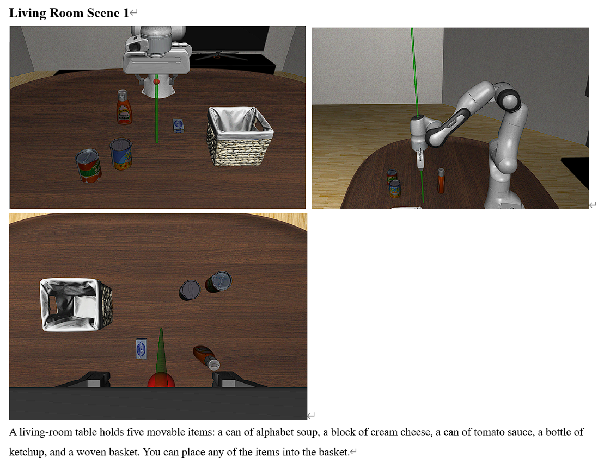
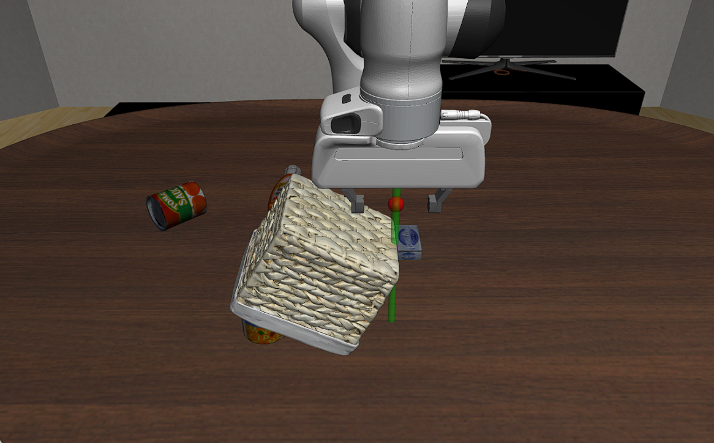
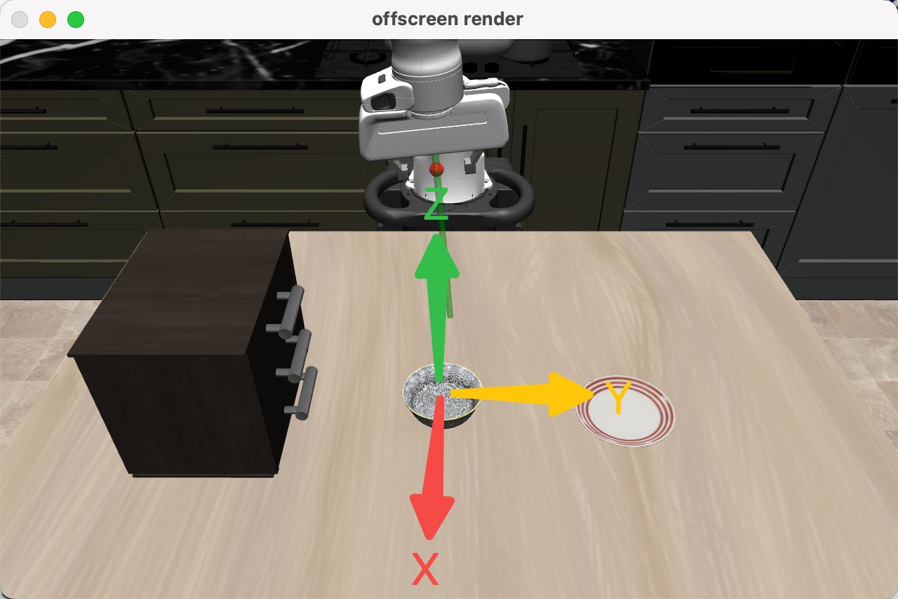

## Introduction
LIBERO provides over 100 task examples, an intuitive teleoperation interface, and a clear, easy-to-follow task‐generation pipeline. However, its modular design and encapsulated logic make it essential to explore the source code yourself once you begin annotating.

Before you start, we recommend reviewing these key scripts and modules:

#### Task (BDDL file) generation and validation:
- `scripts/create_libero_task_example.py`
  - This file is an example to (1) define a scene in the scene class (2) define the task (3) generate bddl file for the task, which represents all necessary information of the task and will be used to set up the task.
- `scripts/collect_demonstration.py`
  - This file is used to teleoperate the robot to complete tasks. It is especially useful when you finish your task design and want to double-check the correctness of your reward code. We provide instructions in the later part.

#### Benchmark scene setup:
This file lists all scenes available in Libero. Each scene is defined as one separate class.
- `libero/libero/benchmark/mu_creation.py`

Predicate definition & Object-state specifications:
- `libero/libero/envs/base_predicates.py`
- `libero/libero/envs/__init__.py`
- `libero/libero/envs/object_states/base_object_states.py`

When designing tasks, feel free to use your imagination to extend or modify the code to achieve the desired effect, as long as the overall structure remains intact!

## Workflow Overview
1. Check the scene
   - First, consult the documentation to review the scene associated with your task. 
   - For a deeper dive, examine the implementation in `mu_creation.py` (You may design your own scenes afterwards!).
2. Implement the reward function
   - We have provided a reward design reference generated by AI in our sheet. This is just for reference and may be useless sometimes. Double-check and design carefully by yourself!
   - (If needed) Reference predefined object states in `base_object_states.py`.
   - (If needed) Define any custom predicates in `base_predicates.py` (and its `__init__.py`). Aim for reusable predicates, but one-offs are fine.
3. Generate the BDDL task file
   - Run your adapted `create_libero_task_example.py` to generate a BDDL task file under `/tmp/bddl/your-bddl-flie.bddl`.
4. Validate via teleoperation
   - Run collect_demonstration.py to ensure your task works as intended. You may try to use the following format:
   ```bash
   /path-to-your-collect_demonstration.py --bddl-file "/tmp/bddl/your-bddl-flie.bddl" --device keyboard --robots Panda
   ```
> **Note:** We provide a automated script to help you generate the BDDL file and validate your task via teleoperation. You can find it in `scripts/auto_tun.py`. This script will automatically generate the BDDL file and start the teleoperation process for you. You can run it with the following command:

```bash
python scripts/auto_run.py <path-to-your-task-file.py>
```

## A Concrete Example

Given a task: ``[living_room_scene_1] turn the basket upside down over the alphabet soup``

1. Check and familiarize yourself with the scene

   

   In the main function of ``scripts/create_libero_task_example.py``, specify ``scene_name`` as ``living_room_scene_1``, ``language`` as the task description ``turn the basket upside down over the alphabet soup``.

2. Start to write reward function

   The success of a task is checked in the variable ``goal_states`` through “predicates”. For example, in ``create_libero_task_example.py``, the first has the following goal_states:

   ```python
   goal_states = [
       ("Open", "wooden_cabinet_1_top_region"),
       ("In", "akita_black_bowl_1", "wooden_cabinet_1_bottom_region"),
   ]
   ```

   Each condition will be evaluated by the corresponding predicate function defined in ``base_predicate.py``. For example, the function ``Open`` is like this:

   ```python
   Class Open(UnaryAtomic):
       def __call__(self, arg):
           return arg.is_open()
   ```

   The ``arg`` here is ``wooden_cabinet_1_top_region``, which is defined as a region object in LIBERO. Each object has its corresponding object state, defined in ``base_object_states.py``. Also, each object has a few predefined functions that help you get the necessary information about objects. These functions can be called in predicate functions to define a high-level predicate, and finally used in ``goal_states``.

   Let's delve deeper into the ``is_open()`` function:

   ```python
   def is_open(self):
   	for joint in self.env.get_object(self.object_name).joints:
           qpos_addr = self.env.sim.model.get_joint_qpos_addr(joint)
           qpos = self.env.sim.data.qpos[qpos_addr]
           if self.env.get_object(self.object_name).is_open(qpos)
               return True
      return False
   ```

   We can see that  it actually uses another ``is_open`` defined in ``libero/envs/objects/articulated_objects.py``.

   ```python
   @register_object
   class WoodenCabinet(ArticulatedObject):
       def __init__(
           self,
           name="wooden_cabinet",
           obj_name="wooden_cabinet",
           joints=[dict(type="free", damping="0.0005")],
       ):
           super().__init__(name, obj_name, joints)
           self.object_properties["articulation"]["default_open_ranges"] = [-0.16, -0.14]
           self.object_properties["articulation"]["default_close_ranges"] = [0.0, 0.005]
   
       def is_open(self, qpos):
           if qpos < max(self.object_properties["articulation"]["default_open_ranges"]):
               return True
           else:
               return False
   
       def is_close(self, qpos):
           if qpos > min(self.object_properties["articulation"]["default_close_ranges"]):
               return True
           else:
               return False
   ```

   If you browse the `objects/` directory, you'll see that each object has its own customized functions. For example, the cabinet defines its own implementations of `is_open` and `is_close`. It's also worth noting that the properties used in these definitions—such as `default_close_ranges`—are further specified in the object's source file (an XML file). For instance, the `WoodenCabinet` has its definitions in `libero/assets/articulated_objects/wooden_cabinet.xml`.

   ```xml
   	      <body name="cabinet_top" pos="0 0.0 0">
                   <inertial pos="0 0 0" mass="3" diaginertia="1 1 1" />
                   <joint name="top_level" type="slide" pos="0 0 0" axis="0 1 0"
   		       limited="true" range="-0.16 0.01" damping="50"/>
   
   ```

   In this case, the file defines the range of the top drawer, which we used in the `is_open` function mentioned earlier. There are many other examples as well—be sure to explore different objects to better inform the design of your task.

   To define your task, you'll need to:

   1. Think about the desired goal state for your task.
   2. Identify or define a predicate that represents this goal state (if one doesn't already exist).
   3. Implement your predicate using the accessible properties and existing functions of the relevant objects.

   Continue on with our example: how to decide whether a basket covers the alphabet soup? Browse ``base_predicates.py`` and find that there aren’t any predefined predicates to ensure that. We may need to define a custom predicate ourselves. 

   Note that “A covers B” means 1. A is upside down, 2. B is contained in A. Since condition 2) can be checked by using the predicate ``In``, we only need to define a predicate to check whether an object is ``UpsideDown``.

   ```python
   # This is the most creative part!
   class UpsideDown(UnaryAtomic):
       def __call__(self, arg):
           geom = arg.get_geom_state()
           w, x, y, z = geom["quat"]
           quat_for_rs = np.array([x, y, z, w])
          	
           R = transform_utils.quat2mat(quat_for_rs)
           z_axis_world = R[:, 2]
           return z_axis_world[2] < 0
       def expected_arg_types(self):
           return [BaseObjectState]
   ```

   Make sure you add the new predicate into ``VALIDATE_PREDICATE_FN_DICT ``in ``predicates/__init__.py``

   Register the task by passing ``language``, ``scene_name``, ``objects_of_interests`` and ``goal_states`` into the function ``register_task_info``.

   ```python
       scene_name = "living_room_scene1"
       language = "turn the basket upside down over the alphabet soup"
       register_task_info(
           language,
           scene_name=scene_name,
           objects_of_interest=["alphabet_soup_1", "basket_1"],
           goal_states=[
               ("In", "alphabet_soup_1", "basket_1_contain_region"),
               ("UpsideDown", "basket_1")
           ]
       )
   
       bddl_file_names, failures = generate_bddl_from_task_info()
       print(bddl_file_names)
   ```

3. Generate the BDDL task file

   Simply run ``create_libero_task_example.py`` and your task will appear in ``/tmp/bddl/your-bddl-flie.bddl``. (If you are a Windows user, make sure ``/tmp`` is created beforehand)

   ```shell
   $ python LIBERO/scripts/create_libero_task_example.py
   Successfully generated: 1
   ['/tmp/pddl/LIVING_ROOM_SCENE1_turn_the_basket_upside_down_over_the_alphabet_soup.bddl']
   ```

4. Validate via teleoperation

   We also provided instructions for teleoperation in the readme file in our repo.

   Run ``collect_demonstration.py`` to start teleoperation for your task, and 

   - Guide the robot to complete your task.
   - Verify the reward: When a task completes successfully, the current teleoperation window will automatically close and, shortly thereafter, a new one will open. The third number in the console shows how many times you’ve succeeded in the current session.
   - Be careful to avoid **reward hacking**, test on any edge cases you can come up with!

   => (teleoperate)

   

   => The third number indicates the number of successes in the current session

   ```shell
   DataCollectionWrapper: making folder at demonstration_data/tmp/libero_living_room_tabletop_manipulation_Ln_turn_the_basket_upside_down_over_the_alphabet_soup/...
   3181
   ['193648263_472938\\ep_37489_872893']
   1 <= pay attention to this number
   ```

   Record the video of you successfully finishing the task via teleoperation and you are ready to submit your implementation!

## Miscellaneous Tips
(Keep updating this section as you explore more so that others can benefit from your experience!)
- **World coordinate system**: In libero, the world coordinate system is defined as follows:
  - The x-axis points towards yourself.
  - The y-axis points to RHS.
  - The z-axis points up.
  
  Here is a visual representation of the coordinate system:
    
- **Positioning**: sometimes you might find it hard to know the exact target position. For example you want to check whether an object is put on the corner of the table but you cannot know the exact position of the corner. In this case, you can print out the current position and target position (there is one in function `PositionWithin` in `base_predicates.py`). However, it is strongly advised to try to calculate the position by yourself through initial state (defined in the scene class, you can know it in the function `define_regions` most of the time) and the size of the object (defined in the xml file of the object) and double-check the position by printing it out.